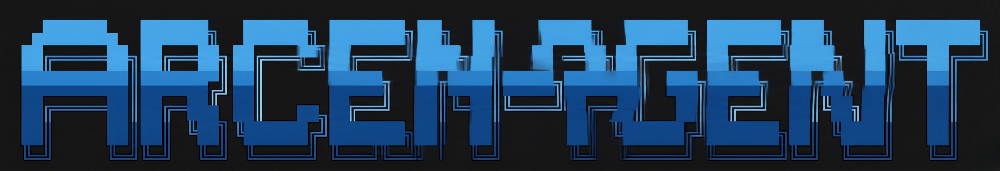

<p align="center">
  
</p>

# Arcen Agent ☤

<p align="center">
  <a href="https://arcen-agent.arcenpay.com/docs/"></a>
  <a href="https://arcenpay.com"></a>
  <a href="https://github.com/arcenpay/arcen-agent/blob/main/LICENSE"></a>
  <a href="https://arcenpay.com"></a>
  <a href="README.zh-CN.md"></a>
</p>

**The self-improving AI agent built by [ArcenPay](https://arcenpay.com).** It's the only agent with a built-in learning loop — it creates skills from experience, improves them during use, nudges itself to persist knowledge, searches its own past conversations, and builds a deepening model of who you are across sessions. Run it on a $5 VPS, a GPU cluster, or serverless infrastructure that costs nearly nothing when idle. It's not tied to your laptop — talk to it from Telegram while it works on a cloud VM.

Use any model you want — [Nous Portal](https://portal.nousresearch.com), [OpenRouter](https://openrouter.ai) (200+ models), [NovitaAI](https://novita.ai) (AI-native cloud for Model API, Agent Sandbox, and GPU Cloud), [NVIDIA NIM](https://build.nvidia.com) (Nemotron), [Xiaomi MiMo](https://platform.xiaomimimo.com), [z.ai/GLM](https://z.ai), [Kimi/Moonshot](https://platform.moonshot.ai), [MiniMax](https://www.minimax.io), [Hugging Face](https://huggingface.co), OpenAI, or your own endpoint. Switch with `arcen model` — no code changes, no lock-in.

<table>
<tr><td><b>A real terminal interface</b></td><td>Full TUI with multiline editing, slash-command autocomplete, conversation history, interrupt-and-redirect, and streaming tool output.</td></tr>
<tr><td><b>Lives where you do</b></td><td>Telegram, Discord, Slack, WhatsApp, Signal, and CLI — all from a single gateway process. Voice memo transcription, cross-platform conversation continuity.</td></tr>
<tr><td><b>A closed learning loop</b></td><td>Agent-curated memory with periodic nudges. Autonomous skill creation after complex tasks. Skills self-improve during use. FTS5 session search with LLM summarization for cross-session recall. <a href="https://github.com/plastic-labs/honcho">Honcho</a> dialectic user modeling. Compatible with the <a href="https://agentskills.io">agentskills.io</a> open standard.</td></tr>
<tr><td><b>Scheduled automations</b></td><td>Built-in cron scheduler with delivery to any platform. Daily reports, nightly backups, weekly audits — all in natural language, running unattended.</td></tr>
<tr><td><b>Delegates and parallelizes</b></td><td>Spawn isolated subagents for parallel workstreams. Write Python scripts that call tools via RPC, collapsing multi-step pipelines into zero-context-cost turns.</td></tr>
<tr><td><b>Runs anywhere, not just your laptop</b></td><td>Six terminal backends — local, Docker, SSH, Singularity, Modal, and Daytona. Daytona and Modal offer serverless persistence — your agent's environment hibernates when idle and wakes on demand, costing nearly nothing between sessions. Run it on a $5 VPS or a GPU cluster.</td></tr>
<tr><td><b>Research-ready</b></td><td>Batch trajectory generation, trajectory compression for training the next generation of tool-calling models.</td></tr>
</table>

---

## Quick Install

### Linux, macOS, WSL2, Termux

```bash
curl -fsSL https://arcen-agent.arcenpay.com/install.sh | bash
```

### Windows (native, PowerShell)

> **Heads up:** Native Windows runs Arcen without WSL — CLI, gateway, TUI, and tools all work natively. If you'd rather use WSL2, the Linux/macOS one-liner above works there too. Found a bug? Please [file issues](https://github.com/arcenpay/arcen-agent/issues).

Run this in PowerShell:

```powershell
iex (irm https://arcen-agent.arcenpay.com/install.ps1)
```

The installer handles everything: uv, Python 3.11, Node.js, ripgrep, ffmpeg, **and a portable Git Bash** (MinGit, unpacked to `%LOCALAPPDATA%\arcen\git` — no admin required, completely isolated from any system Git install). Arcen uses this bundled Git Bash to run shell commands.

If you already have Git installed, the installer detects it and uses that instead. Otherwise a ~45MB MinGit download is all you need — it won't touch or interfere with any system Git.

> **Android / Termux:** The tested manual path is documented in the [Termux guide](https://arcen-agent.arcenpay.com/docs/getting-started/termux). On Termux, Arcen installs a curated `.[termux]` extra because the full `.[all]` extra currently pulls Android-incompatible voice dependencies.
>
> **Windows:** Native Windows is fully supported — the PowerShell one-liner above installs everything. If you'd rather use WSL2, the Linux command works there too. Native Windows install lives under `%LOCALAPPDATA%\arcen`; WSL2 installs under `~/.arcen` as on Linux.

After installation:

```bash
source ~/.bashrc    # reload shell (or: source ~/.zshrc)
arcen              # start chatting!
```

---

## Getting Started

```bash
arcen              # Interactive CLI — start a conversation
arcen model        # Choose your LLM provider and model
arcen tools        # Configure which tools are enabled
arcen config set   # Set individual config values
arcen gateway      # Start the messaging gateway (Telegram, Discord, etc.)
arcen setup        # Run the full setup wizard (configures everything at once)
arcen claw migrate # Migrate from OpenClaw (if coming from OpenClaw)
arcen update       # Update to the latest version
arcen doctor       # Diagnose any issues
```

📖 **[Full documentation →](https://arcen-agent.arcenpay.com/docs/)**

## CLI vs Messaging Quick Reference

Arcen has two entry points: start the terminal UI with `arcen`, or run the gateway and talk to it from Telegram, Discord, Slack, WhatsApp, Signal, or Email. Once you're in a conversation, many slash commands are shared across both interfaces.

| Action                         | CLI                                           | Messaging platforms                                                              |
| ------------------------------ | --------------------------------------------- | -------------------------------------------------------------------------------- |
| Start chatting                 | `arcen`                                      | Run `arcen gateway setup` + `arcen gateway start`, then send the bot a message |
| Start fresh conversation       | `/new` or `/reset`                            | `/new` or `/reset`                                                               |
| Change model                   | `/model [provider:model]`                     | `/model [provider:model]`                                                        |
| Set a personality              | `/personality [name]`                         | `/personality [name]`                                                            |
| Retry or undo the last turn    | `/retry`, `/undo`                             | `/retry`, `/undo`                                                                |
| Compress context / check usage | `/compress`, `/usage`, `/insights [--days N]` | `/compress`, `/usage`, `/insights [days]`                                        |
| Browse skills                  | `/skills` or `/<skill-name>`                  | `/<skill-name>`                                                                  |
| Interrupt current work         | `Ctrl+C` or send a new message                | `/stop` or send a new message                                                    |
| Platform-specific status       | `/platforms`                                  | `/status`, `/sethome`                                                            |

For the full command lists, see the [CLI guide](https://arcen-agent.arcenpay.com/docs/user-guide/cli) and the [Messaging Gateway guide](https://arcen-agent.arcenpay.com/docs/user-guide/messaging).

---

## Documentation

All documentation lives at **[arcen-agent.arcenpay.com/docs](https://arcen-agent.arcenpay.com/docs/)**:

| Section                                                                                             | What's Covered                                             |
| --------------------------------------------------------------------------------------------------- | ---------------------------------------------------------- |
| [Quickstart](https://arcen-agent.arcenpay.com/docs/getting-started/quickstart)                 | Install → setup → first conversation in 2 minutes          |
| [CLI Usage](https://arcen-agent.arcenpay.com/docs/user-guide/cli)                              | Commands, keybindings, personalities, sessions             |
| [Configuration](https://arcen-agent.arcenpay.com/docs/user-guide/configuration)                | Config file, providers, models, all options                |
| [Messaging Gateway](https://arcen-agent.arcenpay.com/docs/user-guide/messaging)                | Telegram, Discord, Slack, WhatsApp, Signal, Home Assistant |
| [Security](https://arcen-agent.arcenpay.com/docs/user-guide/security)                          | Command approval, DM pairing, container isolation          |
| [Tools & Toolsets](https://arcen-agent.arcenpay.com/docs/user-guide/features/tools)            | 40+ tools, toolset system, terminal backends               |
| [Skills System](https://arcen-agent.arcenpay.com/docs/user-guide/features/skills)              | Procedural memory, Skills Hub, creating skills             |
| [Memory](https://arcen-agent.arcenpay.com/docs/user-guide/features/memory)                     | Persistent memory, user profiles, best practices           |
| [MCP Integration](https://arcen-agent.arcenpay.com/docs/user-guide/features/mcp)               | Connect any MCP server for extended capabilities           |
| [Cron Scheduling](https://arcen-agent.arcenpay.com/docs/user-guide/features/cron)              | Scheduled tasks with platform delivery                     |
| [Context Files](https://arcen-agent.arcenpay.com/docs/user-guide/features/context-files)       | Project context that shapes every conversation             |
| [Architecture](https://arcen-agent.arcenpay.com/docs/developer-guide/architecture)             | Project structure, agent loop, key classes                 |
| [Contributing](https://arcen-agent.arcenpay.com/docs/developer-guide/contributing)             | Development setup, PR process, code style                  |
| [CLI Reference](https://arcen-agent.arcenpay.com/docs/reference/cli-commands)                  | All commands and flags                                     |
| [Environment Variables](https://arcen-agent.arcenpay.com/docs/reference/environment-variables) | Complete env var reference                                 |

---

## Migrating from OpenClaw

If you're coming from OpenClaw, Arcen can automatically import your settings, memories, skills, and API keys.

**During first-time setup:** The setup wizard (`arcen setup`) automatically detects `~/.openclaw` and offers to migrate before configuration begins.

**Anytime after install:**

```bash
arcen claw migrate              # Interactive migration (full preset)
arcen claw migrate --dry-run    # Preview what would be migrated
arcen claw migrate --preset user-data   # Migrate without secrets
arcen claw migrate --overwrite  # Overwrite existing conflicts
```

What gets imported:

- **SOUL.md** — persona file
- **Memories** — MEMORY.md and USER.md entries
- **Skills** — user-created skills → `~/.arcen/skills/openclaw-imports/`
- **Command allowlist** — approval patterns
- **Messaging settings** — platform configs, allowed users, working directory
- **API keys** — allowlisted secrets (Telegram, OpenRouter, OpenAI, Anthropic, ElevenLabs)
- **TTS assets** — workspace audio files
- **Workspace instructions** — AGENTS.md (with `--workspace-target`)

See `arcen claw migrate --help` for all options, or use the `openclaw-migration` skill for an interactive agent-guided migration with dry-run previews.

---

## Contributing

We welcome contributions! See the [Contributing Guide](https://arcen-agent.arcenpay.com/docs/developer-guide/contributing) for development setup, code style, and PR process.

Quick start for contributors — clone and go with `setup-arcen.sh`:

```bash
git clone https://github.com/arcenpay/arcen-agent.git
cd arcen-agent
./setup-arcen.sh     # installs uv, creates venv, installs .[all], symlinks ~/.local/bin/arcen
./arcen              # auto-detects the venv, no need to `source` first
```

Manual path (equivalent to the above):

```bash
curl -LsSf https://astral.sh/uv/install.sh | sh
uv venv .venv --python 3.11
source .venv/bin/activate
uv pip install -e ".[all,dev]"
scripts/run_tests.sh
```

---

## Community

- 🌐 [ArcenPay](https://arcenpay.com)
- 📚 [Skills Hub](https://agentskills.io)
- 🐛 [Issues](https://github.com/arcenpay/arcen-agent/issues)
- 🔌 [computer-use-linux](https://github.com/avifenesh/computer-use-linux) — Linux desktop-control MCP server for Arcen and other MCP hosts, with AT-SPI accessibility trees, Wayland/X11 input, screenshots, and compositor window targeting.
- 🔌 [ArcenClaw](https://github.com/AaronWong1999/arcenclaw) — Community WeChat bridge: Run Arcen Agent and OpenClaw on the same WeChat account.

---

## License

MIT — see [LICENSE](LICENSE).

Built by [ArcenPay](https://arcenpay.com).
